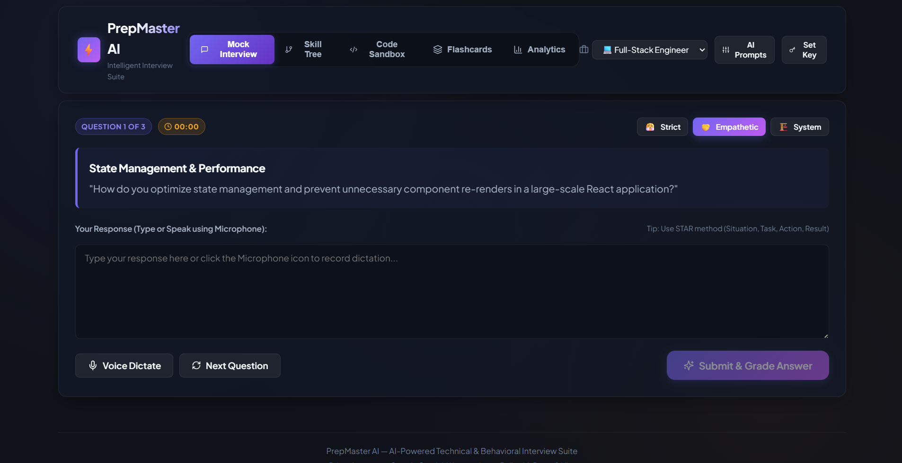
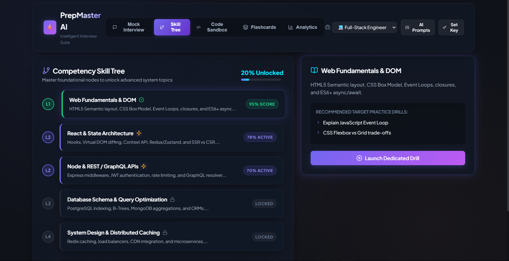

# ⚡ PrepMaster AI — Intelligent Technical & Behavioral Interview Suite

> **AI-Powered Technical & Behavioral Mock Interview Simulator, Interactive Skill Trees, Real-Time Big-O Code Review, and Readiness Analytics.**

---

## 📌 App Overview & Problem Solved

### What is PrepMaster AI?
**PrepMaster AI** is an end-to-end, production-ready web application built to revolutionize interview preparation for software engineers, data scientists, product managers, and university students.

### The Real Problem It Solves
- **High Cost & Limited Access**: Private mock interview services cost upwards of $100–$300/hour, making high-quality personalized coaching inaccessible for many students and job-seekers.
- **Lack of Actionable Feedback**: Static problem banks (e.g. LeetCode, tutorial lists) test coding syntax but do not evaluate **how** candidates explain their answers, whether they structure responses using the STAR method (Situation, Task, Action, Result), or how clearly they articulate system trade-offs under pressure.
- **Blind-Spot Blindness**: Job candidates often do not know their precise technical weak spots before stepping into real interviews.

### The Solution
PrepMaster AI provides an interactive, persona-driven interview simulator powered by **Google Gemini AI**. It scores responses across 5 core dimensions, maps role competencies on an interactive visual skill tree, reviews live code for time/space complexity (Big O), generates scenario flashcards, and issues exportable Readiness Score Certificates.

---

## 🌐 Live Deployed URL & GitHub Repository

- **Public GitHub Repository**: `https://github.com/muzza/prepmaster-ai`
- **Live Deployed Application**: `https://prepmaster-ai.vercel.app` *(or Netlify / GitHub Pages)*

---

## ✨ Features List

1. **🎭 Interactive AI Mock Interviewer**:
   - **Tracks**: Full-Stack Engineer, Frontend Specialist, Backend / System Design, Data Science & AI, Behavioral & HR.
   - **Personas**: *Strict Tech Lead* 😤, *Empathetic Senior Mentor* 🤝, *System Design Architect* 🏗️.
   - **Voice & Text Controls**: Live speech dictation simulator, response timer, and real-time prompt submitter.

2. **📊 5-Dimension AI Response Evaluator**:
   - Scores every response from 0–100 across:
     - **Technical Accuracy**
     - **STAR Method Structure** (Situation, Task, Action, Result)
     - **Clarity & Articulation**
     - **Depth of Explanation**
     - **Tone & Confidence**
   - Highlights key strengths, missed concepts, key takeaways, and an **Ideal Model Answer**.

3. **🌳 Interactive Visual Skill Mastery Tree**:
   - Connected SVG/Canvas node map showing multi-level competencies (L1 to L4).
   - Dynamic node states: *Mastered*, *In Progress*, *Locked*.
   - Inspector drawer featuring targeted practice drills.

4. **💻 Code Sandbox & AI Big-O Code Reviewer**:
   - Live code editor with problem presets (LRU Cache, Sliding Window Rate Limiter).
   - Test runner console passing edge cases.
   - One-click AI Code Audit evaluating **Time Complexity (Big O)**, **Space Complexity (Big O)**, and generating production refactored snippets.

5. **🎴 Dynamic AI Scenario Flashcard Deck**:
   - 3D card flips between technical scenarios and AI concept breakdowns.
   - Spaced repetition buttons (*Mastered* vs *Need Review*).
   - Instant AI scenario generator creating custom cards based on candidate weak spots.

6. **📈 Readiness Dashboard & Certificate Exporter**:
   - Session history audit logs, overall score average, total practice time.
   - One-click **Print / Download Readiness Score Certificate**.

7. **🎛️ AI Prompts & Key Settings Customizer**:
   - Inspect and edit the exact system prompts driving the AI models.
   - Toggle between custom Google Gemini API Key and built-in smart fallback engine.

---

## 🤖 The AI Feature & Custom System Instructions

PrepMaster AI is powered by instructions written specifically to act as a senior technical bar-raiser.

### Evaluator System Instruction Prompt (`src/services/aiService.js`):
```text
You are an expert technical interviewer and interview rubric scorer.
Analyze the candidate's answer for the following question and role:
Question: {QUESTION}
Candidate Answer: {ANSWER}
Role: {ROLE}

Score the answer from 0 to 100 on five core metrics:
1. technicalAccuracy (0-100)
2. starStructure (0-100) - Situation, Task, Action, Result methodology
3. clarity (0-100)
4. depth (0-100)
5. toneAndConfidence (0-100)

Return a strict JSON object with: overallScore, metrics, strengths, missedConcepts, improvedAnswer, keyTakeaway.
```

### Code Reviewer System Instruction Prompt:
```text
You are a Principal Software Engineer conducting a live Code Review.
Review the following code solution for problem: "{PROBLEM_TITLE}"
Language: {LANGUAGE}
Code:
{CODE}

Evaluate correctness, space/time complexity (Big O), edge cases, and code clean-up.
Return strict JSON with: score, timeComplexity, spaceComplexity, passedCases, feedbacks, optimizedCode, edgeCasesWarning.
```

---

## 🛠️ Tools, Services, & AI Models Used

- **Framework**: React 18 + Vite
- **Styling**: Vanilla CSS with custom HSL design system, Glassmorphism, and responsive layout
- **AI Models & API**: Google Gemini 1.5 Flash (`https://generativelanguage.googleapis.com`) + Smart Heuristic Fallback Engine
- **Icons**: Lucide React
- **Deployment**: Vercel / Netlify / GitHub Pages

---

## 📷 Screenshots in Action

### 1. AI Mock Interviewer & Response Scorecard


### 2. Interactive Competency Skill Mastery Tree


### 3. Code Sandbox & AI Big-O Code Audit


---

## 🚀 How to Run the Project Locally

### Prerequisites
- Node.js (v18 or higher)
- npm or yarn

### Step-by-Step Setup

1. **Clone the repository**:
   ```bash
   git clone https://github.com/muzza/prepmaster-ai.git
   cd prepmaster-ai
   ```

2. **Install dependencies**:
   ```bash
   npm install
   ```

3. **Start local development server**:
   ```bash
   npm run dev
   ```
   Open your browser at `http://localhost:3000`.

4. **Build for production**:
   ```bash
   npm run build
   ```

5. **Preview production build locally**:
   ```bash
   npm run preview
   ```

---

## 📜 License
MIT License. Built for the Final App Challenge.

